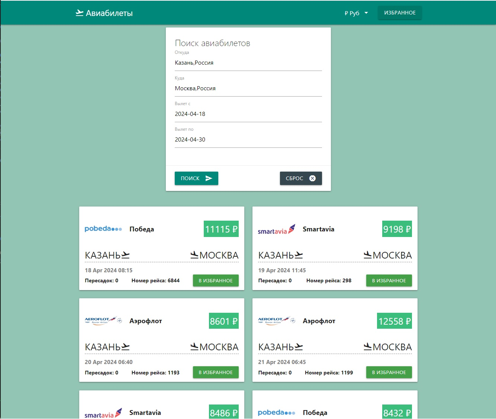

# Авиабилеты

## Описание: 
Авиабилеты - это приложение для поиска и подбора авиабилетов.

## Функционал:
Приложение "Авиабилеты" имеет следующий функционал:
- поиск и отрисовка авиабилетов по заданным направлениям в выбранные даты;
- возможность смены валюты цены авиабилетов;
- возможность добавления авиабилетов в раздел "Избранное";
- возможность плавного скролла вверх при большом количестве найденных билетов (кнопка скролла вверх появляется в правом нижнем углу);
- возможность просмотра билетов, добавленных в избранное;
- возможность удаления конкретного билета из избранного, а также удаления сразу всех билетов, в случае, если в избранном находится больше 1 билета;

## Стек:
- HTML
- CSS
- JS 
- Materialize 

## Скриншоты:

## Ссылка на проект:

[Авиабилеты](https://github.com/OlgaBul/Aviatickets/src/index.html)